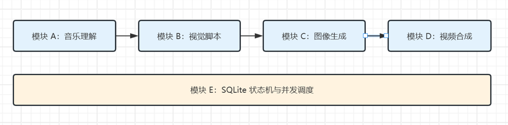
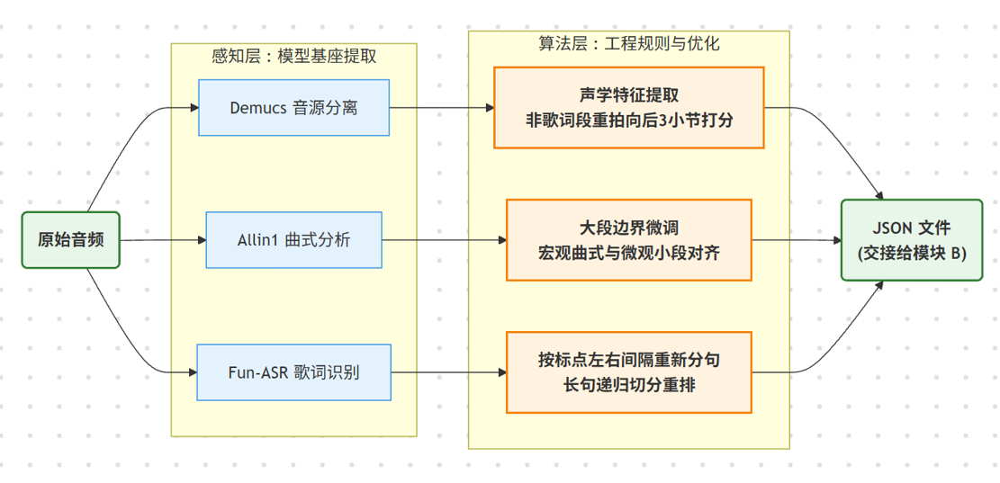
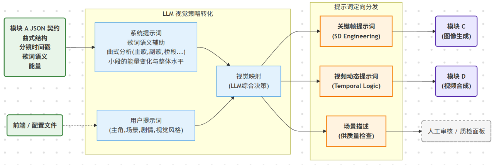

# AI-Director：基于结构化上下文与 LLM 编排的自动化卡点视频生产工作流

本项目从输入音频出发，先做结构理解，再生成分镜、关键帧、视频片段与最终成片。它是一个带有状态持久化、交互式 CLI、跨模块波前调度、定向重试与任务监督页面的可恢复多模态生成流水线。

## 核心能力

- 模块 A V2 会结合 Demucs、FunASR、all-in-one 特征与 librosa 特征，产出 `big_segments`、`segments`、`beats`、`lyric_units`、`energy_features` 等结构化结果。
- 模块 B 负责把音频结构转成可执行的视觉脚本，按 segment 粒度生成 `scene_desc`、`keyframe_prompt`、`video_prompt`，并支持结构化解析、重试与自定义 prompt 覆盖。
- 模块 C 负责关键帧生成，并记录 LoRA / base model 绑定信息，便于追踪生成来源。
- 模块 D 支持 `ffmpeg` 与 `animatediff` 两种后端、shot 级并行渲染、单元重试、终拼策略切换，以及 copy 失败后的回退重编码。
- B/C/D 已经接入跨模块波前并行调度；在真实生成链路下，可以边出分镜、边出关键帧、边渲染视频片段，并根据 GPU 负载动态收缩/放宽并发窗口。
- 全流程状态写入 SQLite，支持 `resume`、单模块调试、segment / shot 定向补跑、监督页面、产物上传与评测脚本。

## 主流程



## 模块 A：结构理解链路



- 感知层会并行抽取 Demucs 音源分离结果、Allin1 曲式分析结果和 Fun-ASR 歌词识别结果。
- 算法层会把这些基础信号继续整理成可交给下游的结构化时间轴，而不是只保留原始检测结果。
- 最终输出是稳定 JSON 契约，供模块 B 做视觉脚本生成。

## 模块 B：视觉策略转化链路



- 模块 B 以模块 A 的 JSON 契约为输入，再叠加系统提示词与用户提示词，形成 LLM 的视觉决策上下文。
- 一次生成会拆成三类结果：关键帧提示词、视频动态提示词、场景描述。
- 这些结果分别服务于模块 C、模块 D，以及人工审校 / 质检面板。

## 项目结构

```text
.
├── src/music_video_pipeline/
│   ├── cli.py / interactive_cli.py / command_service.py
│   ├── pipeline.py / state_store.py / monitoring/
│   ├── generators/                     # 分镜与关键帧生成器工厂
│   ├── modules/
│   │   ├── module_a_v2/               # 音频理解、内容角色、可视化
│   │   ├── module_b/                  # 分镜与 prompt 生成
│   │   ├── module_c/                  # 关键帧生成
│   │   ├── module_d/                  # 片段渲染与终拼
│   │   └── cross_bcd/                 # B/C/D 跨模块波前调度
│   └── upload/                        # 百度网盘上传链路
├── configs/
│   ├── music_wsl/                     # 本地 laptop(4060) 的 WSL 配置档
│   ├── music_yby/                     # 云显卡服务器配置档
│   ├── prompts/                       # 模块 B prompt 模板
│   └── *.json                         # 模型绑定、模块默认配置
├── docs/
│   ├── cli/
│   ├── module_a_v2/
│   ├── module_b/
│   ├── module_d/
│   ├── 环境/
│   ├── 会话列表/
│   └── images/architecture/           # 推荐放架构图
├── scripts/
│   ├── model_assets/                  # 模型资源下载、绑定、同步
│   ├── clip_eval/                     # 自动评测与人工抽测
│   └── _module_a_v2_visualize.py
├── resources/
├── tests/                             # 测试
└── README.md
```

## 环境要求

- Python `3.11.x`
- `uv`
- `ffmpeg` / `ffprobe`
- 推荐 Linux / WSL2；当前依赖和现成配置档主要围绕 Linux x86_64 环境组织
- 真实 AnimateDiff 链路建议显存 24G

安装依赖：

```bash
uv sync
```

安装测试依赖：

```bash
uv sync --extra test
```

## 快速开始

### 推荐入口：交互式 CLI

`mvpl` 现在默认就是交互式入口；对于人类使用，推荐直接走菜单流。

```bash
uv run --no-sync mvpl
```

如果你不在项目根目录，可以显式指定项目路径：

```bash
uv run --project /path/to/music_video_pipeline --no-sync mvpl
```

交互模式里可以直接完成这些操作：

- 首次运行时创建任务：填写 `task_id`、配置文件、输入音频，然后直接发起全链路执行。
- 继续已有任务：从状态库里挑选最近任务，不必重新手敲 `task_id`、`config`、`audio_path`。
- 单模块调试：只执行指定模块，适合排查 A/B/C/D 某一段逻辑。
- 常规排障：查看模块 B、C、D 单元状态，以及跨模块 B/C/D 链路状态。
- 高级重跑：在高级菜单里执行 `run-force`、`resume-force`、`run-module --force`，或对指定 `segment_id` / `shot_id` 做定向重试。
- 交互式补充视觉指令：当命令会触发模块 B 时，可以临时覆盖用户提示词，不必改配置文件。
- 人工观察：按需手动启动任务监督页面，查看任务实时状态与落盘产物。

### 保留入口：非交互式命令

仓库当前提供的可用配置档主要在 `configs/music_wsl/` 和 `configs/music_yby/`：
- `configs/music_wsl/`: 本地 WSL 环境
- `configs/music_yby/`: 在云显卡服务器上的环境

下例统一显式传配置路径：

```bash
uv run --no-sync mvpl run --task-id demo_20s --config configs/music_wsl/default.json
uv run --no-sync mvpl run --task-id demo_20s --audio-path resources/juebieshu.m4a --config configs/music_wsl/default.json
uv run --no-sync mvpl resume --task-id demo_20s --config configs/music_wsl/default.json
uv run --no-sync mvpl run-module --task-id demo_20s --module A --audio-path resources/juebieshu.m4a --config configs/music_wsl/default.json
uv run --no-sync mvpl b-task-status --task-id demo_20s --config configs/music_wsl/default.json
uv run --no-sync mvpl c-task-status --task-id demo_20s --config configs/music_wsl/default.json
uv run --no-sync mvpl d-task-status --task-id demo_20s --config configs/music_wsl/default.json
uv run --no-sync mvpl bcd-task-status --task-id demo_20s --config configs/music_wsl/default.json
uv run --no-sync mvpl monitor --task-id demo_20s --config configs/music_wsl/default.json
```

定向重试命令保留不变；实际使用时请先通过状态命令确认目标 ID：

```bash
uv run --no-sync mvpl b-retry-segment --task-id demo_20s --segment-id <segment_id> --config configs/music_wsl/default.json
uv run --no-sync mvpl c-retry-shot --task-id demo_20s --shot-id <shot_id> --config configs/music_wsl/default.json
uv run --no-sync mvpl d-retry-shot --task-id demo_20s --shot-id <shot_id> --config configs/music_wsl/default.json
uv run --no-sync mvpl bcd-retry-segment --task-id demo_20s --segment-id <segment_id> --config configs/music_wsl/default.json
```

## 常见产物

一次任务通常会在 `<runs_dir>/<task_id>/` 下生成这些内容：

- `artifacts/module_a_output.json`
- `artifacts/module_b_output.json`
- `artifacts/module_c_output.json`
- `artifacts/module_d_output.json`
- `final_output.mp4`
- `<task_id>_module_a_v2_visualization.html`
- `task_monitor.html`

状态数据库默认位于 `<runs_dir>/pipeline_state.sqlite3`，其中会同时记录任务级、模块级、单元级状态。

## 关键配置

重点关注这些字段：

- `paths.runs_dir`: 运行输出根目录
- `paths.default_audio_path`: 默认输入音频
- `module_b.llm.prompt_template_file`: 模块 B prompt 模板
- `module_b.llm.user_custom_prompt`: 交互式临时覆盖 prompt
- `module_d.render_backend`: `ffmpeg` 或 `animatediff`
- `cross_module.global_render_limit` / `cross_module.adaptive_window.*`: 跨模块并发与自适应窗口
- `bypy_upload.*`: 任务产物上传开关与远端路径

## 测试与辅助命令

运行测试：

```bash
uv run --no-sync pytest
```

评测入口：

```bash
uv run --no-sync eval
```

模型资源管理入口：

```bash
uv run --no-sync model_assets
```

## 相关文档

- `docs/5分钟跑通指南.md`
- `docs/cli/项目CLI命令大全.md`
- `docs/cli/命令组合与作用速查.md`
- `docs/module_a_v2/模块A_V2_总链.mmd`
- `docs/module_b/模块B真实链接入说明.md`
- `docs/module_d/模块D并行提速报告.md`
- `AGENTS.md`
